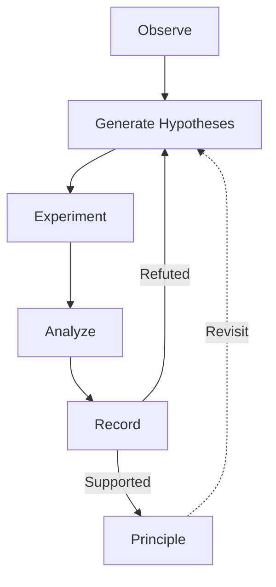

# Lab

Experiments for devising and testing prompt engineering principles using scientific method.

## Structure

Each experiment topic gets its own folder with a `README.md` describing the topic. Data files (e.g. question-answer pairs) use JSONL. Using the exam system is encouraged.

## Hypothesis Generation

Several methods may be utilized (not a closed list). These may be combined in various ways.

- Come up with your own hypothesis.
- Use agent(s) to generate hypotheses. Try assigning them various backgrounds to approach a problem from various perspectives.
- Observe existing data to come up with hypotheses.
- Ask other LLMs (using invoke-llm). Use an up-to-date list of LLM models.
  - Meta-hypothesis: higher temperature (> 1.0) is better for creative exploration.

## Experiment and Analyze

- Before experiment, set up clear success/fail criteria for evaluation.
- Always compare with a baseline (control group).
- Flukes exist. A fail-to-success change does not always indicate hypothesis accepted.

## Rules

- Do not presume details. Do not write unverified knowledge. This applies to both principles and hypothesis records.
- Only write what the user stated or what an experiment produced. If neither applies, do not write it.
