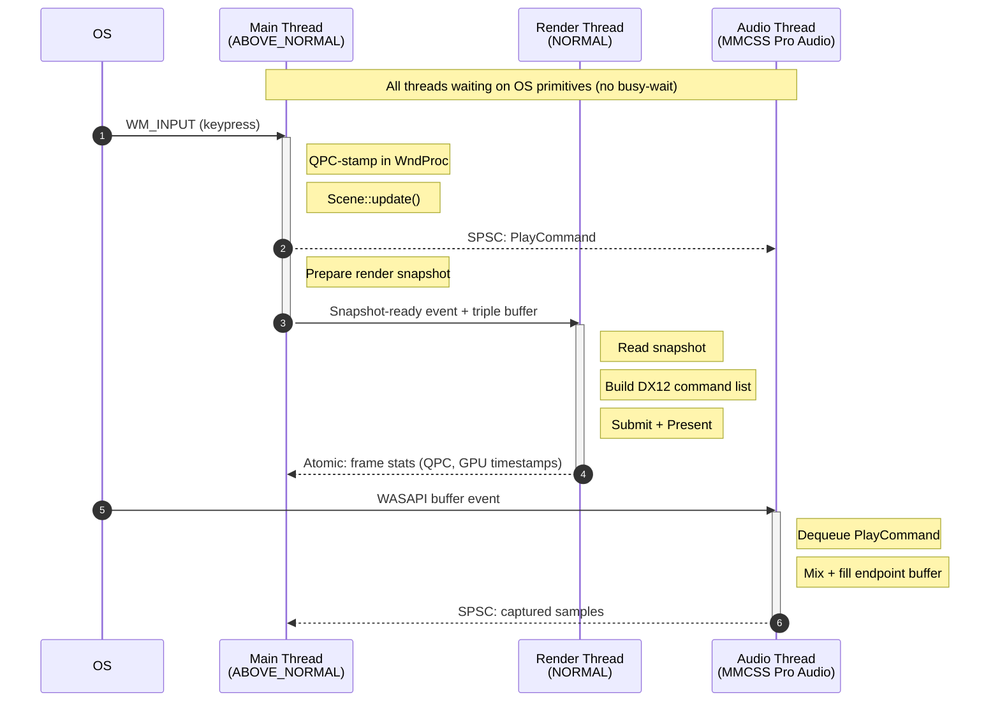

+++
id = "s0002"
title = "Application Architecture"
tags = ["architecture"]
paths = ["src/**"]
+++

## Behavior

Canopus is a multi-scene desktop application with strict latency constraints. The architecture targets less than 0.1ms total software overhead on any latency-critical path (input, audio, rendering), and must not exceed 1ms (from s0001). Individual subcomponents must contribute negligible overhead. Modularity (swappable FFT backends, future cross-platform audio/input) must not compromise this budget.

### Application Lifecycle

The application starts, initializes subsystems, enters a scene loop, and shuts down cleanly. Scenes are the top-level unit of user interaction — only one scene is active at a time.

TODO **Initialization order:**

1. Logging (opens log file, starts log writer thread — available for all subsequent init)
2. Window (Win32 window creation)
3. Input Subsystem (registers Raw Input on the window)
4. Audio Subsystem (initializes WASAPI devices, starts audio thread)
5. Render Subsystem (initializes DX12 device and swapchain, starts render thread)
6. Scene Manager (receives references to all subsystems)
7. Enter main loop

Shutdown is reverse order. Scene manager tears down the active scene first. Render subsystem waits on GPU fences to ensure in-flight command lists complete before releasing resources. Then remaining subsystems release resources in reverse initialization order.

### Thread Model

TODO Three threads plus an optional log writer. Render and audio threads each support two modes depending on the active scene's needs:

Arrow key: solid (`->>`) = event/signal, dotted (`-->>`) = lock-free async data (SPSC queue or atomic). Diagram shows the reactive case (input-triggered). In continuous mode, the render thread wakes on DXGI cadence and the audio thread streams continuously; the communication mechanisms are identical.

**Main Thread** — Owns the Win32 window and message pump. Processes `WM_INPUT` in WndProc (see s0003). Runs scene update logic and prepares render snapshots. Priority: `ABOVE_NORMAL`. Blocks efficiently between iterations (no busy-wait) — wakes when messages arrive or scene-driven events signal. The blocking primitive (e.g., `MsgWaitForMultipleObjects`) must be re-armed after draining messages to avoid missed wakeups.

Main loop per iteration:
1. Block until messages available or scene timer fires (no busy-wait)
2. Drain and dispatch all pending messages (WndProc QPC-stamps each `WM_INPUT`)
3. Scene `update(input_events, dt)` — process input, advance state
4. Scene `process_capture_data(samples)` — dequeue and handle mic data (if applicable)
5. Scene `prepare_render_snapshot()` — write visual state to snapshot write buffer, publish via atomic exchange, signal render thread

**Render Thread** — Owns DX12 rendering (see s0005). Priority: `NORMAL`.

**Audio Thread** — Dedicated WASAPI thread (see s0004). MMCSS "Pro Audio" priority.

**Log Writer Thread** (optional) — Low-priority background thread (see s0008).

**Why this arrangement:**
- `WM_INPUT` is delivered through the Win32 message queue bound to the window-owning thread. Putting input on the main thread is the natural design with zero overhead.
- WASAPI exclusive-mode event-driven model requires a dedicated high-priority thread for glitch-free audio.
- DX12 rendering is decoupled so GPU command submission and fence waits never block input processing.

**Timer** — Not a subsystem. QPC requires no initialization (frequency is fixed at boot). All components call `QueryPerformanceCounter` directly. A thin utility may cache the frequency and provide tick-to-µs conversion, but there is no lifecycle to manage.

### Inter-Component Communication

TODO Four mechanisms, chosen per data path. All lock-free queues are pre-allocated with fixed capacity before their producer/consumer threads start.

**Triple-buffered render snapshot (Main → Render):**
Three snapshot buffers. The main thread writes to a dedicated write buffer. On completion, it atomically exchanges the write buffer's index with the "latest" index. The render thread atomically exchanges the "latest" index with its own read index, obtaining the most recent complete snapshot. The third buffer is always free for the next write. No locks, no torn reads — each party exclusively owns its buffer at any given time. If the main thread hasn't published a new snapshot, the render thread re-renders from its current read buffer.

**Lock-free SPSC ring buffers (Main ↔ Audio):**
- **Command queue (Main → Audio):** Fixed-capacity ring buffer, pre-allocated. Main thread enqueues audio commands. Audio thread dequeues during buffer fill.
- **Capture queue (Audio → Main):** Fixed-capacity ring buffer, pre-allocated. Audio thread enqueues captured sample blocks. Main thread dequeues during scene update for FFT analysis.

**Atomic frame statistics (Render → Main):**
Render thread writes presentation QPC, frame index, and GPU timestamp to an aligned struct via atomic store. Main thread reads via atomic load. One-frame staleness at worst — acceptable for calibration display.

**Lock-free MPSC log queue (All → Log Writer):**
All threads enqueue log entries (text + QPC timestamp) without blocking. The log writer thread drains and writes to file. Logging must never stall a latency-critical thread.

### Timestamp Correlation

TODO All components use QPC as the single monotonic time source (tick-to-µs conversion via cached frequency).

- **Input events:** QPC-stamped per event in WndProc (see s0003 for caveats).
- **Audio playback/capture:** QPC-stamped at buffer fill/read (see s0004 for systematic offsets).
- **Frame presentation:** `SyncQPCTime` from `GetFrameStatistics` (see s0005 for windowed-mode caveats).

Calibration measurements derive from QPC deltas:
- **Input-to-audio (software):** `audio_fill_qpc + buffer_period - input_event_qpc`.
- **Input-to-audio (hardware, mic-based):** mic onset detection timestamps the captured keypress sound relative to the playback timestamp.
- **Input-to-photon:** `frame_present_qpc - input_event_qpc` (requires fullscreen for reliable `SyncQPCTime`).
- **Audio-to-mic roundtrip:** `capture_onset_qpc - playback_qpc`.

### Failure Policy

TODO Subsystem initialization failures (WASAPI device unavailable, DX12 device creation failure, etc.) are reported to the user and the application exits cleanly with a diagnostic message (via logging if available, otherwise stderr/message box).

Runtime failures trigger a clean shutdown. The application does not attempt hot recovery; the user restarts. This is acceptable for a calibration utility that is not a long-running service.

## Constraints

- Total software overhead on any latency-critical path targets 0.1ms and must not exceed 1ms (from s0001). Individual subcomponents must contribute negligible overhead.
- Input and graphics must run on separate threads (from s0001).
- Subsystem interfaces must be abstract enough to swap implementations (FFT backend, future audio/input backends) without changing calling code.
- Monotonic timestamps with 1µs or better resolution must be available to all subsystems (from s0001).
- No busy-wait loops. All threads block efficiently on OS primitives between work items.
- All lock-free queues pre-allocated with fixed capacity before their threads start.
- A compile-time configuration must exist for internal performance instrumentation (orthogonal to runtime text logging). When enabled, it measures architecture-imposed latencies at key points: main loop iteration time, message drain duration, scene update duration, render thread wake-to-present time, audio thread buffer fill duration, and FFT computation time. When disabled, zero overhead — no measurement code executes.

## Anticipated Changes

- Cross-platform audio backend (replacing WASAPI).
- Cross-platform input backend (GameInput or other).
- Lua scripting for VSRG graphics may need a scripting subsystem.
- Additional scenes will be added over time; architecture must not assume a fixed scene set.

## Dangers

- Lock contention between threads destroying latency guarantees.
- Over-abstraction introducing indirection that defeats the latency goal.
- Thread priority inversion causing audio glitches or input drops.
- Subsystem initialization order bugs causing silent failures.
- **FFT duration on the main thread is unvalidated.** FFT runs synchronously in `process_capture_data()`, after input reaction but before the next frame's render snapshot. Main loop ordering guarantees it never blocks the current frame's latency-critical response, but it delays the next frame's input processing by the full FFT duration — and increases QPC timestamp error for input events arriving during the FFT. Must be profiled as soon as the FFT is implemented. If it exceeds budget, offload to a worker thread.
